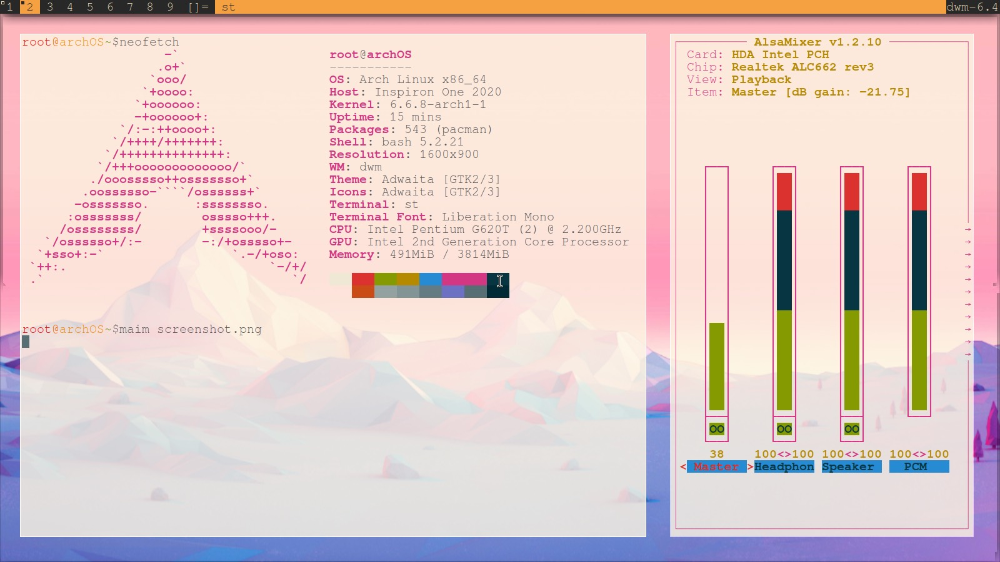
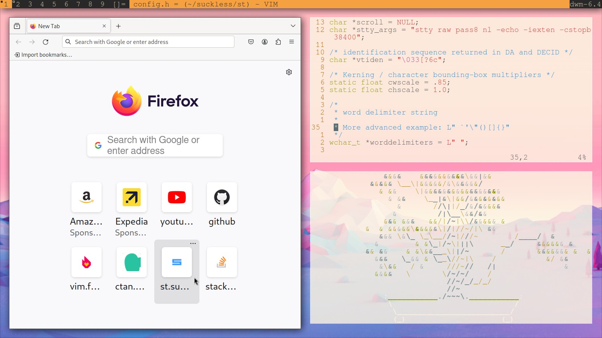

# Arch Linux Dotfiles

Welcome to my Arch Linux dotfiles repository! This collection includes configuration files and scripts for customizing my Arch Linux setup, including the Bash shell, Vim editor, X server, and suckless programs (dmenu, dwm, and st). The repository is designed to make it easy to replicate my Arch Linux environment on other machines.




## Usage

To use these dotfiles on your Arch Linux machine:

1. Clone the repository:

   ```bash
   git clone git@github.com:MSO03/.dotfiles.git
   ```

2. Navigate to the dotfiles directory:

   ```bash
   cd arch-dotfiles
   ```

3. Use a tool like GNU Stow to create symbolic links for the desired configurations:

   ```bash
   stow bash vim x suckless
   ```

   This will create symlinks for the Bash, Vim, Xinitrc, and suckless program configurations in your home directory.

## Suckless Programs

This repository includes configurations and patches for the following suckless programs:

- **Dmenu**: Dynamic menu for X.
- **Dwm**: Dynamic window manager.
- **St**: Simple terminal emulator.

## Patches

The suckless programs come with additional patches to enhance functionality. Check the respective `patches/` folder in each of the suckless programs for more information.


```

Feel free to customize these dotfiles according to your preferences and share your improvements!
